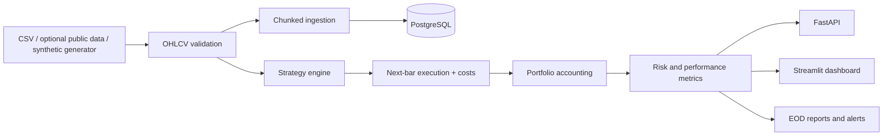

# Portfolio Trading System


A production-style, non-AI trading research platform for ingesting market data, testing rule-based strategies, measuring portfolio risk, storing longitudinal results in PostgreSQL, and generating end-of-day reports and alerts.

> **Research and portfolio project only. It does not place live trades or provide financial advice.**

## Why this version is different

The original repository was a compact SQL prototype. This redesign turns it into a runnable application with:

- Five-year, multi-asset backtesting
- Explicit commission and slippage modeling
- No-look-ahead next-bar execution
- SMA crossover, RSI mean-reversion, momentum, and buy-and-hold strategies
- Portfolio and benchmark equity curves
- Sharpe, Sortino, CAGR, volatility, drawdown, Calmar, win-rate, profit-factor, and turnover metrics
- A chunked ingestion benchmark for 2M+ simulated intraday records
- PostgreSQL tables for market data, lineage, strategies, backtests, orders, trades, positions, metrics, and alerts
- Automated HTML/JSON end-of-day reporting
- Optional SMTP email delivery
- Large-move, unusual-volume, and drawdown alerts
- FastAPI endpoints
- An interactive Streamlit research dashboard
- Docker Compose, tests, linting, and GitHub Actions CI

## Architecture



More detail is available in [`docs/architecture.md`](docs/architecture.md).

## Repository structure

```text
app/                         Streamlit interactive dashboard
artifacts/                   Generated local run outputs
 data/                       Sample/offline data location
 docs/                       Architecture and benchmark evidence
 legacy/                     Original SQL prototype
 scripts/                    Demo and benchmark entry points
 sql/schema.sql              Production-style PostgreSQL schema
 sql/analytics.sql           Portfolio and risk analytics queries
 src/trading_system/
   alerts/                   Alert rules
   data/                     Synthetic, CSV, optional public-data loaders
   engine/                   Backtesting and metrics
   reporting/                HTML/JSON reports and SMTP delivery
   storage/                  Local and PostgreSQL repositories
   strategies/               Trading strategies
 tests/                       Unit and API tests
```

## Quick start

### 1. Create a virtual environment

```bash
python3 -m venv .venv
source .venv/bin/activate
python -m pip install --upgrade pip
python -m pip install -e '.[dev]'
```

### 2. Run the tests

```bash
python -m pytest
```

### 3. Run a five-year backtest

```bash
python -m trading_system.cli backtest \
  --strategy sma_crossover \
  --years 5 \
  --short-window 20 \
  --long-window 100 \
  --commission-bps 2 \
  --slippage-bps 1
```

The command writes:

- `summary.json`
- `equity_curve.csv`
- `asset_results.csv`
- `trades.csv`
- `eod/eod_report.html`
- `eod/eod_report.json`

The default data is synthetic so the application works offline. Do not describe the synthetic series as real historical market data.

## Use actual five-year market history

Install the optional adapter:

```bash
python -m pip install -e '.[market-data]'
```

Then use `trading_system.data.download_yfinance()` to download symbols and save the resulting canonical OHLCV dataframe to CSV. Public data availability, adjustments, and licensing should be checked before publishing or relying on a dataset.

## Interactive dashboard

```bash
streamlit run app/dashboard.py
```

The dashboard includes:

- Strategy and parameter controls
- Synthetic-data or CSV selection
- Equity curve versus benchmark
- Monthly return heatmap
- Trade ledger and CSV download
- Drawdown visualization
- Transaction-cost stress testing
- Operational alerts
- Data-quality checks

## FastAPI

```bash
uvicorn trading_system.api:app --reload
```

Open `http://127.0.0.1:8000/docs`.

Example request:

```bash
curl -X POST http://127.0.0.1:8000/backtests \
  -H 'Content-Type: application/json' \
  -d '{
    "strategy": "momentum",
    "years": 5,
    "initial_capital": 100000,
    "commission_bps": 2,
    "slippage_bps": 1,
    "parameters": {"lookback": 63, "threshold": 0.02}
  }'
```

## Two-million-record ingestion benchmark

Run:

```bash
python -m trading_system.cli benchmark \
  --rows 2000000 \
  --symbols 100 \
  --chunk-size 250000
```

The pipeline generates one simulated trading day's intraday records in chunks and aggregates them into per-symbol OHLCV bars without holding the full raw dataset in memory.

A checked development run processed **2,000,000 synthetic records** and wrote its measured throughput to [`docs/benchmark_results.json`](docs/benchmark_results.json). Runtime is hardware-dependent, so rerun the benchmark on your own machine before quoting a throughput figure.

## PostgreSQL

Start PostgreSQL, the API, and dashboard:

```bash
docker compose up --build
```

The schema models:

- `assets`
- `ingestion_runs`
- `market_bars`
- `strategies`
- `backtest_runs`
- `orders`
- `trades`
- `positions`
- `portfolio_snapshots`
- `performance_metrics`
- `alerts`

This structure supports longitudinal strategy comparison, data lineage, execution-cost analysis, portfolio snapshots, and alert history.

## End-of-day reporting and notifications

Every CLI backtest produces an HTML and JSON report containing performance metrics, recent trades, and active alerts.

Email delivery is optional. Copy `.env.example` to `.env` and configure:

```text
SMTP_HOST=
SMTP_PORT=587
SMTP_USERNAME=
SMTP_PASSWORD=
SMTP_SENDER=
REPORT_RECIPIENT=
```

Credentials must never be committed to GitHub.

## Backtesting safeguards

This project explicitly addresses several common research mistakes:

- Signals are shifted and executed on the following bar to reduce look-ahead bias.
- Commission and slippage are deducted from position turnover.
- Invalid OHLCV rows and duplicate symbol/timestamp keys are checked.
- Strategy performance is compared against an equal-weight benchmark.
- Cost stress tests show whether results survive less favorable execution assumptions.

It does not yet model exchange-specific calendars, partial fills, market impact, borrow fees, taxes, corporate actions, or survivorship bias. Those are documented limitations rather than hidden assumptions.

## Testing and CI

```bash
python -m pytest
ruff check src tests app scripts
```

The test suite covers:

- Multi-asset backtesting
- Next-bar execution behavior
- Invalid OHLCV rejection
- Risk metrics
- Price and drawdown alerts
- API endpoints
- Chunked ingestion

GitHub Actions runs linting and tests for every push and pull request.

##  Flow

1. Open the Streamlit dashboard.
2. Select SMA, RSI, momentum, or buy-and-hold.
3. Adjust transaction costs and strategy parameters.
4. Run the backtest over five years and multiple asset classes.
5. Compare the strategy with the benchmark.
6. Inspect drawdowns and individual trades.
7. Increase costs in the Risk Lab and show how performance changes.
8. Open the generated end-of-day report.
9. Show the PostgreSQL schema and ingestion benchmark.


## Future extensions

- Walk-forward and rolling out-of-sample testing
- Portfolio rebalancing and volatility targeting
- Limit, stop, and partial-fill execution models
- Corporate-action and adjusted-price handling
- Parameter sweeps and experiment comparison
- Paper-trading adapter
- Webhook notifications
- TimescaleDB or Parquet lakehouse storage
- Data-contract and schema-drift checks
