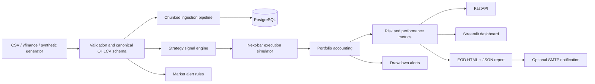

# Architecture

## Key design decisions

- **No look-ahead execution:** signals created from one bar are executed on the following bar.
- **Costs are explicit:** commission and slippage assumptions are charged on position turnover.
- **Data-source isolation:** synthetic, CSV, and optional public-data adapters emit one canonical dataframe schema.
- **Offline-first demo:** the complete project can be tested without API keys or live-market access.
- **Human-readable artifacts:** every backtest can write JSON, CSV, and HTML outputs for inspection.
- **Relational lineage:** PostgreSQL tables separate ingestion runs, market data, strategies, backtests, orders, trades, positions, metrics, and alerts.
